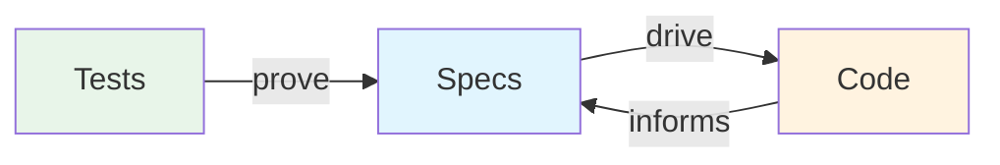
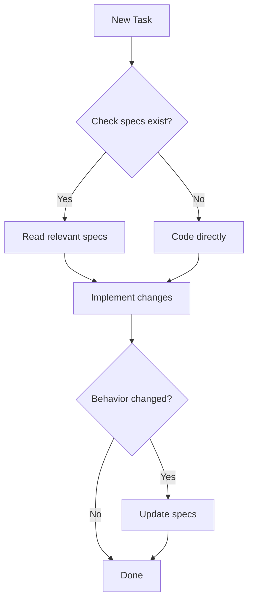
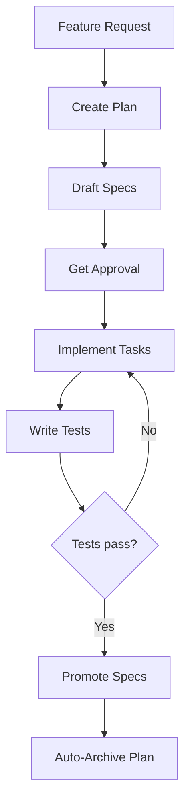
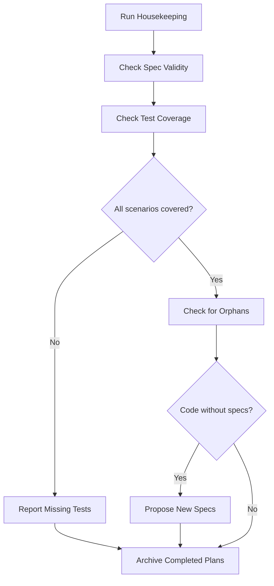

# Livespec

**Living specifications for AI-native development.**

Specs that evolve with your code. Not documentation that rots.

```
npx @ftzi/livespec
```

---

## 😤 The Problem

You write specs. You write code. They drift apart. Nobody updates the specs. They become lies.

Traditional specs fail because:
- **Manual maintenance** — humans forget, get lazy, move on
- **One-way flow** — specs → code, but code never → specs
- **No enforcement** — nothing checks if specs match reality

## 💡 The Solution

Livespec treats specifications as **living documents** maintained by AI:

```
livespec/
├── livespec.md                    # AI instructions (how to use livespec)
├── projects/
│   └── my-app/
│       ├── project.md             # Domain knowledge, conventions
│       └── auth/
│           └── spec.md            # Feature spec with testable scenarios
└── plans/
    ├── active/                    # In-progress changes
    └── archived/                  # Completed plans (history)
```

**AI reads your specs before coding. AI updates specs when code changes. AI validates coverage.**

## ⚙️ How It Works

### The Core Loop



### 1. Specs are the target, not the truth

Code can be updated first. Specs reconciled later. Bidirectional sync.

```markdown
### Scenario: Email validation on login [APP.auth.login.email-validation]
Testing: e2e

- WHEN user enters invalid email format
- THEN error message "Please enter a valid email" is shown
- AND submit button remains disabled
```

### 2. Tests are the source of truth

Specs describe intent. **Tests prove it's real.**

```typescript
/** @spec [APP.auth.login.email-validation] */
it('shows error for invalid email', () => {
  render(<LoginForm />)
  fireEvent.change(emailInput, { target: { value: 'not-an-email' } })
  expect(screen.getByText('Please enter a valid email')).toBeVisible()
  expect(submitButton).toBeDisabled()
})
```

If the test passes, the spec is true. If the test fails, something needs to change — the code or the spec.

### 3. AI maintains everything

Run `/livespec` in Claude Code, Cursor, Copilot, or Windsurf:

- **Before coding** — AI reads relevant specs
- **While coding** — AI notes when behavior diverges
- **After coding** — AI proposes spec updates
- **Housekeeping** — AI validates coverage, finds orphans, syncs everything

## 🔄 Workflows

### Regular Development



### Plan-Driven Development

For significant features, AI creates plans first:



### Housekeeping

Periodic sync to keep everything healthy:



## 🚀 Quick Start

```bash
npx @ftzi/livespec
```

This creates:
- `livespec/` directory structure
- `/livespec` command for your AI tool
- Project template to customize

Then in your AI coding assistant:

```
/livespec add user authentication with email/password
```

AI creates a plan, writes specs, implements code, links tests.

## 🧠 Philosophy

| Traditional Specs | Livespec |
|-------------------|----------|
| Write once, forget | Continuously maintained |
| Humans update manually | AI updates automatically |
| Specs → Code (one-way) | Specs ↔ Code (bidirectional) |
| Hope tests match | Tests prove specs are true |
| Docs rot | Living documentation |

### Principles

- **Specs are the target** — aspirational, not absolute truth
- **Tests are the proof** — a spec is only true if a test proves it
- **Bidirectional sync** — code informs specs, specs drive code
- **AI-native** — maintenance by AI, not scripts
- **Feature-centric** — one spec per feature, not per file

## 📝 Spec Format

```markdown
# Authentication [APP.auth]

User authentication flow for the application.

## Entry Points

| Route | Description |
|-------|-------------|
| /login | Login page |
| /register | Registration page |

---

## Login [APP.auth.login]

### Scenario: Successful login [APP.auth.login.success]
Testing: e2e

- WHEN user enters valid credentials
- AND clicks submit
- THEN user is redirected to dashboard
- AND session token is stored

### Scenario: Invalid password [APP.auth.login.invalid-password]
Testing: e2e

- WHEN user enters wrong password
- THEN error "Invalid credentials" is shown
- AND password field is cleared
```

## 📋 Plan-Driven Development

For significant changes, AI creates plans first:

```markdown
# Plan: Add Password Reset

## Summary
Add forgot password flow with email verification.

## Tasks

### Phase 1: Backend
- [ ] Add reset token generation
- [ ] Create email template
- [ ] Add reset endpoint

### Phase 2: Frontend
- [ ] Add forgot password link
- [ ] Create reset form
- [ ] Handle token validation

## Affected Specs
- `[APP.auth.password-reset]` — ADDED
```

Plans live in `livespec/plans/active/` until complete, then auto-archive.

## 🤖 Supported AI Tools

| Tool | Command Location |
|------|------------------|
| Claude Code | `.claude/commands/livespec.md` |
| GitHub Copilot | `.github/prompts/livespec.prompt.md` |
| Cursor | `.cursor/prompts/livespec.md` |
| Windsurf | `.windsurf/workflows/livespec.md` |

## 💬 Commands

In your AI assistant:

- **`/livespec`** — Project companion. Shows status, helps plan features, guides implementation.
- **`/livespec-sync`** — Validates specs, checks test coverage, archives completed plans.

## 🤔 Why Not Just Comments?

Comments describe *what*. Specs describe *why* and *what should happen*.

Comments:
```typescript
// Validate email format
if (!isValidEmail(email)) {
  setError('Invalid email')
}
```

Specs:
```markdown
### Scenario: Email validation [APP.auth.login.email-validation]
Testing: unit

- WHEN user enters invalid email format
- THEN error message "Please enter a valid email" is shown
- AND submit button remains disabled
```

Specs are **testable**, **traceable**, and **maintainable**.

## ❓ FAQ

**Q: Do I need to write all specs upfront?**
No. Write specs as you go. AI helps. Code can come first, specs follow.

**Q: What if specs and code disagree?**
AI housekeeping detects mismatches. You decide which is correct. Update accordingly.

**Q: Is this just for new projects?**
No. Run `npx @ftzi/livespec` in any project. Add specs incrementally.

**Q: What languages/frameworks?**
Any. Specs are markdown. Test linking works with any language that supports comments.

## 🔄 Updating

To update livespec to the latest version:

```bash
npx @ftzi/livespec@latest
```

Select "Update base files" when prompted. This updates:
- `livespec/livespec.md` — AI instructions
- Command files for your AI tools

### Version Tracking

Each `livespec.md` file includes a version comment:

```markdown
<!-- livespec-version: 0.4.0 -->
```

This tracks which version of livespec created or last updated the file. Useful for:
- Knowing when to update
- Debugging version mismatches across team members
- Understanding which features are available

## 🤝 Contributing

Issues and PRs welcome at [github.com/ftzi/livespec](https://github.com/ftzi/livespec).

## 📄 License

MIT
