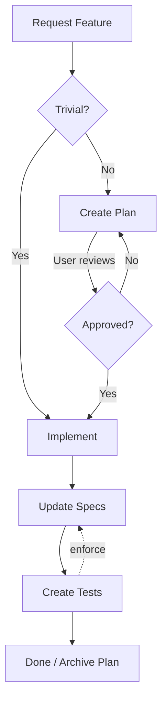
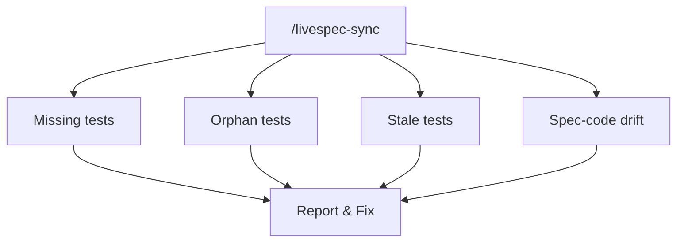

<br/>
<br/>
<p align="center">
  
</p>
<br/>
<p align="center">
  <strong>Living specs for AI-driven development.</strong><br>
  Where specs and code stay in sync.
</p>

<p align="center">
  <a href="https://www.npmjs.com/paci likage/livespec"></a>
  <a href="https://github.com/ftzi/livespec/blob/main/LICENSE"></a>
  <a href="https://github.com/ftzi/livespec/actions/workflows/ci.yml"></a>
</p>
<br/>

## 📐 Foundations

Livespec ensures your software works as intended. Requirements become specs, specs become tests, tests prove the system behaves correctly.

- **Specs are the source of truth.** They document what the system does. When specs and code drift apart, `/livespec-sync` catches it.
- **Tests enforce specs.** Every scenario links to a test that validates its behavior.
- **Decisions documented.** Design rationale and edge cases live in the spec, not in your head.
- **Specs double as AI context.** No need to manually explain what specs already document.
- **Language agnostic.** Specs are Markdown, tests use whatever you prefer.

Inspired by [Openspec](https://github.com/f/openspec).

---

## 🔄 How It Works

### Building Features



### Keeping Specs & Code in Sync (`/livespec-sync`)



---

## 🚀 Quick Start

Works with **Claude Code**, **Cursor**, **Windsurf**, and **GitHub Copilot**. [Request others](https://github.com/ftzi/livespec/issues).

```bash
npx livespec  # or: bunx, pnpm dlx, yarn dlx
```

This sets up livespec. Then run `/livespec-setup` with your AI to populate some generated files using your project information and optionally generate initial specs for your codebase.

Now just naturally ask your AI to build features — it will create feature plans for non-trivial tasks, update specs, and create and link tests.

> [!TIP] > **Updating:** The same command can be used to update livespec to the latest version.

---

## 📁 Structure

```
livespec/
├── livespec.md              # AI instructions
├── projects/
│   └── my-app/
│       ├── project.md       # Domain knowledge, conventions
│       └── auth/
│           └── spec.md      # Feature spec with scenarios
└── plans/
    ├── active/              # Work in progress
    └── archived/            # Completed plans
```

---

## 📝 Spec Format (Summary)

Specs document features with testable scenarios:

```markdown
# Authentication [APP.auth]

User authentication for the application.

## UI

### Figma

https://figma.com/file/...

---

## Login [APP.auth.login]

### Scenario: Successful login [APP.auth.login.success]

- WHEN user enters valid credentials
- THEN user is redirected to dashboard
```

Tests link to specs' scenarios with `@spec`:

```typescript
/** @spec [APP.auth.login.success] */
it("redirects to dashboard after login", () => { ... });
```

See the [full reference](./templates/livespec.md) for entry points, design decisions, test types, and more.

---

## ⚡ Commands

Optional commands for explicit operations:

- `/livespec` — Show status, active plans, and suggestions
- `/livespec-setup` — Run after initializing or upgrading livespec to automatically populate .md files and optionally generate initial specs for existing code
- `/livespec-sync` — Keep specs healthy: finds scenarios without tests, tests without specs, and drift between documentation and code

---

## 📖 Full Reference

See [`livespec/livespec.md`](./templates/livespec.md) for the full documentation.

---

## 🤝 Contributing

Contributions and suggestions are very welcome! [Open an issue](https://github.com/ftzi/livespec/issues) or submit a PR.
